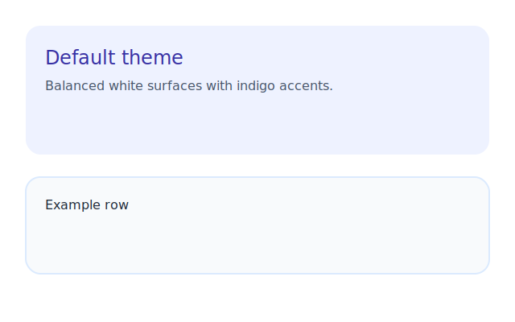
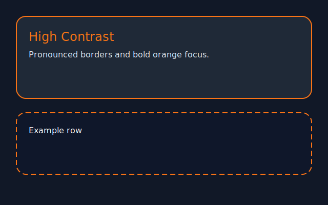
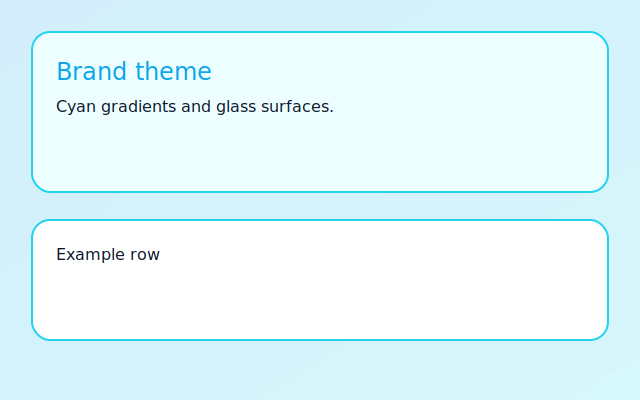

# Release Management Theme Kılavuzu

Bu doküman, Release Management modülündeki tema anahtarlarının nasıl çalıştığını ve mevcut seçeneklerin (`Default`, `High Contrast`, `Brand`) hangi yüzeyleri etkilediğini özetler.

## Token Özeti

- `--rm-surface`, `--rm-surface-subtle`, `--rm-surface-subtle-dark`: kartlar, filtre paneli, seçim çubuğu ve tablo başlıklarında kullanılan temel arka plan tonları.
- `--rm-border-soft`, `--rm-border-soft-dark`: hafif sınırlar ve hover durumları.
- `--rm-accent-1`, `--rm-accent-2`: focus ring, buton/ikon vurguları, ölçüm çubukları.

## Tema Seçenekleri

| Tema | Açıklama | Yüzey tonu | Accent |
|------|----------|------------|--------|
| Default | Varsayılan açık/koyu için dengeli kontrast | Beyaz / koyu gri | Indigo / Grape |
| High Contrast | Erişilebilirlik için daha belirgin sınırlar ve vurgular | Parlak beyaz / koyu mat gri | Antrasit & turuncu |
| Brand | Markaya uygun mavi tonlar | Açık mavi degrade | Camgöbeği & turkuaz |

Tema seçici `Theme` drop-down ile değiştirildiğinde `data-theme` niteliği `rm-root` üzerine yazılır, tokenlar buna göre override edilir.

> Tamamlandı: `docs/img/rm-theme-default.svg`, `rm-theme-contrast.svg`, `rm-theme-brand.svg` görselleri referans alın.

### Ekran görüntüsü planı
1. `npm run sandbox` ile style sandbox’ı başlat ve `http://localhost:4174/style-sandbox.html` adresini aç.
2. `Theme` açılır menüsünden sırasıyla `Default`, `High Contrast`, `Brand` değerlerini seç; hem light hem de Dark modda ekran al.
3. Güncel yer tutucuları `docs/img/rm-theme-*.svg` dosyalarıyla değiştirmek için gerçek ekran görüntülerini aynı adlarla kaydet.

## Sandbox ile önizleme

```
npm run sandbox
```

Komut sonrası `http://localhost:4174/style-sandbox.html` adresinden kart, boş durum ve tema varyantlarını canlı olarak görebilirsiniz. Açılan sayfa üzerinden ekran görüntülerini almak kolaylaşır.




