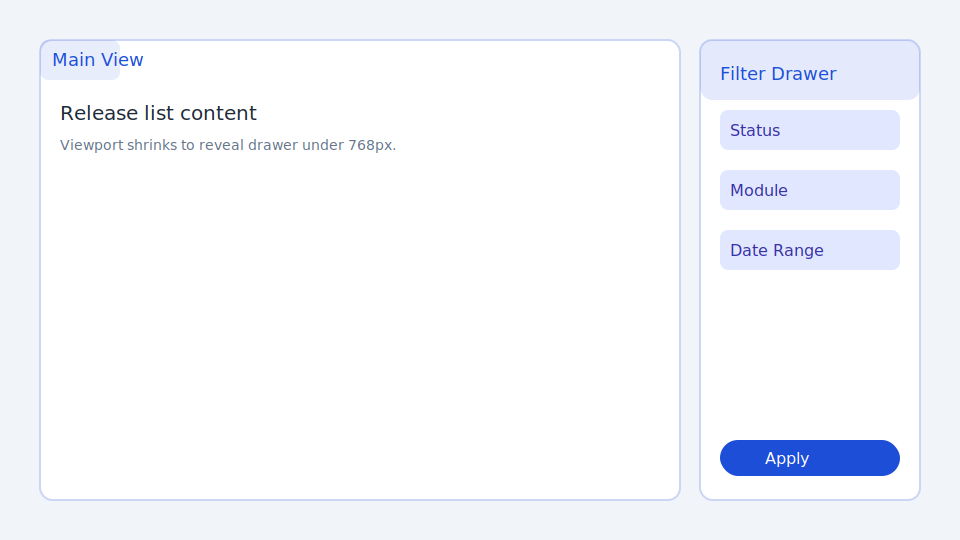
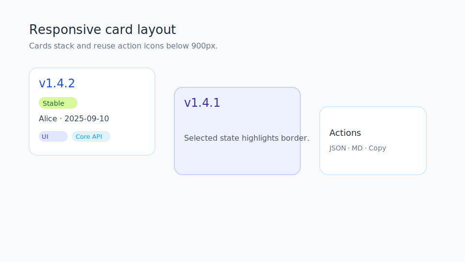
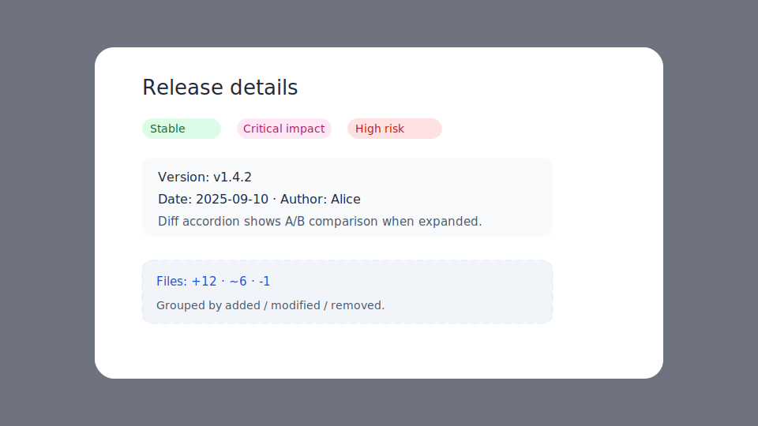
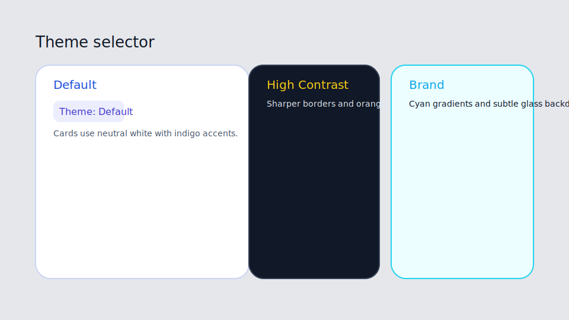
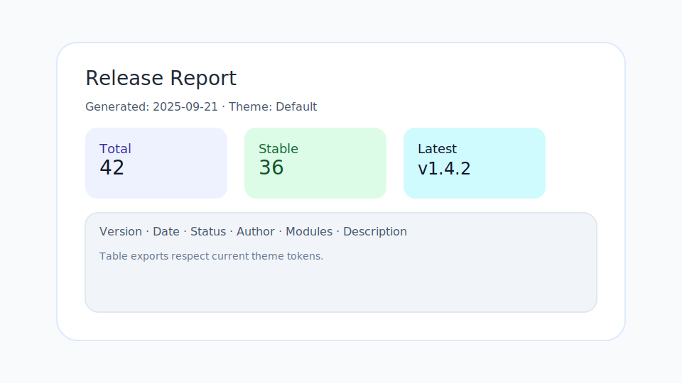

# Release Management — Visual & UX Updates (v1.3.392+)

## Recent polish
- Filter panel now behaves as a slide-in drawer below 768 px (backdrop, scroll-lock, badge counter) and stays inline on larger screens.
- Release list switches to a responsive card layout under 900 px; cards reuse action-menu icons, support selection, and animate on focus/tap.
- Theme tokens (`--rm-surface*`) harmonise light/dark backgrounds for cards, selection bar, control bar, and sticky table elements.
- Compare modal toggles gained inline glyphs (≠ / Σ) and softened gradients for clearer hierarchy without overpowering content.
- Manual release modal carries contextual header copy, field hints, and consistent surface styling with the rest of the module.
- Theme selector (`Theme: Default / High Contrast / Brand`) drives token overrides—saved in `localStorage` so the chosen palette persists between sessions.
- Empty states now display an illustrated CTA and quick filter chips; cards/tables hide to spotlight the next action.
- Export menu now includes an HTML report (`release-report.html`) that bundles theme styling and summary metrics into a single page.
- `npm run sandbox` komutu `docs/style-sandbox.html` için hafif bir statik sunucu açar; kart, boş durum ve modal bileşenlerini farklı tema/dark mod kombinasyonlarında hızlıca kontrol edebilirsiniz.

- Quick filters: Stable, Last 30 days, Files only
- Selection bar: multi‑select with Select all / Page only / Invert, Export (CSV/MD/JSON), Copy (CSV/MD), Compare (2 items), Delete
- Compare: sticky header and sticky bottom action bar; A/B badges; copy link with clipboard fallback
- Display density: Standard / Comfortable / Compact
- Hotkeys: `/` search, `n` new, `g` or Cmd/Ctrl+K go, `r` reset, `?` help
- Accessibility: `aria-sort` on headers, `aria-selected` on rows, selection bar `aria-live`, focus‑visible styles
- Copy/export robust: clipboard fallback and error toasts on export/copy failures
- Minor visuals: stat card icons, dark‑mode borders/opacity, mobile table height, column menu/resizer guards
- Virtualized table rendering hits ~115 ms for 1,200 records (goal <200 ms), validated by `tests/release.virtualization.test.js`.

## Notes
- Selection persists across filters; use Page only to scope bulk actions to the current page.
- Compare activates only with exactly 2 selections.
- Exports respect column visibility when enabled (Export visible columns).

## Visual guide (tamamlandı)
- [x] Filter drawer open on mobile (`docs/img/rm-filter-drawer.svg`)
- [x] Card layout with progress chips (`docs/img/rm-card-layout.svg`)
- [x] Detail modal highlighting risk/impact tags (`docs/img/rm-detail-modal.svg`)
- [x] Theme switcher (contrast/brand) side-by-side (`docs/img/rm-theme-switcher.svg`)
- [x] HTML export report preview (`docs/img/rm-html-report.svg`)

### Ekran görüntüsü çalışma planı
1. `npm run sandbox` komutunu çalıştırarak `http://localhost:4174/style-sandbox.html` sayfasını aç.
2. Üstteki Dark mode ve Theme anahtarları ile aşağıdaki senaryoları sırayla yakala:
   - **Mobile filter drawer**: Tarayıcı genişliğini ≤768 px yap, `Filter` butonuna bas ve açık halde yakala.
   - **Card layout**: Grid bölümünde kartların tamamı görünürken seçim durumu (`rm-release-card--selected`) aktif bir örnek göster.
   - **Detail modal**: “Detail Modal Snippet” alanında risk/impact etiketlerinin yer aldığı tam görünümü kaydet.
   - **Theme switcher**: Theme seçiciyi `High Contrast` ve `Brand` olarak ayrı ayrı çek; gerekirse aynı karede iki sekme.
   - **HTML export**: `npm run build` sonrasında üretilen `release-report.html` dosyasını tarayıcıda açıp metrik kartları görünür halde kaydet.
3. Dosyaları `docs/img/` altına kaydet, adları TODO maddeleriyle uyumlu olsun, ardından check list’te tiki ekle.
